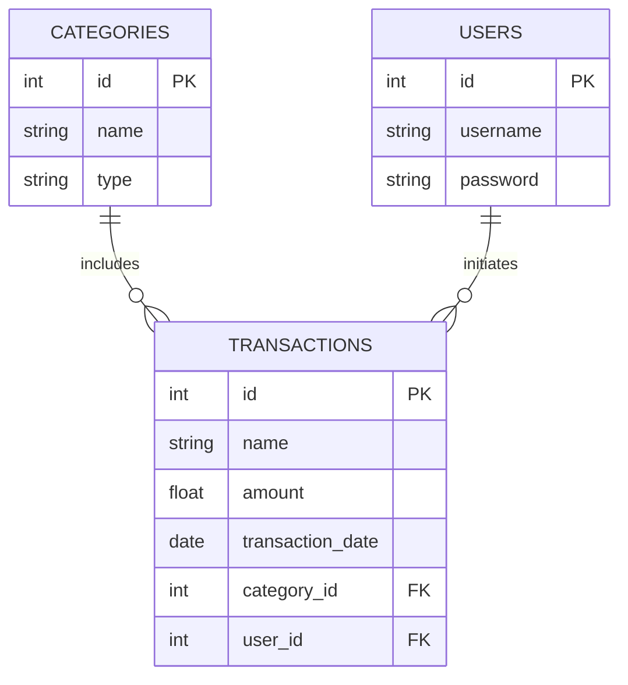

# Database Schema

```mermaid
erDiagram
    CATEGORIES {
        int id PK
        string name
        string type
    }
    TRANSACTIONS {
        int id PK
        string name
        float amount
        date transaction_date
        int category_id FK
        int user_id FK
    }
    USERS {
        int id PK
        string username
        string password
    }

    CATEGORIES ||--o{ TRANSACTIONS : includes
    USERS ||--o{ TRANSACTIONS : initiates
```